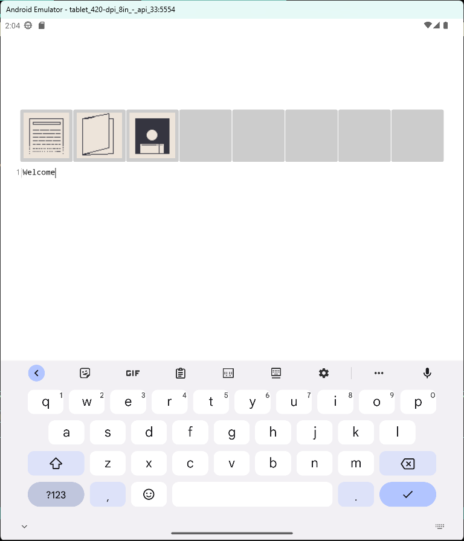

# Tabula
An IDE written in C# + Avalonia for Android.

## Overview
-A (WIP) fully featured IDE for Android, for when you want or need to code on a tablet or other device, but don't have the means otherwise.

### Features
- A simple and reactive UI powered by Avalonia
- A powerful set of standard features such as syntax highlighting, code completion, and more powered by AvaloniaEdit (WIP).

### Screenshot

### Special Thanks
...
